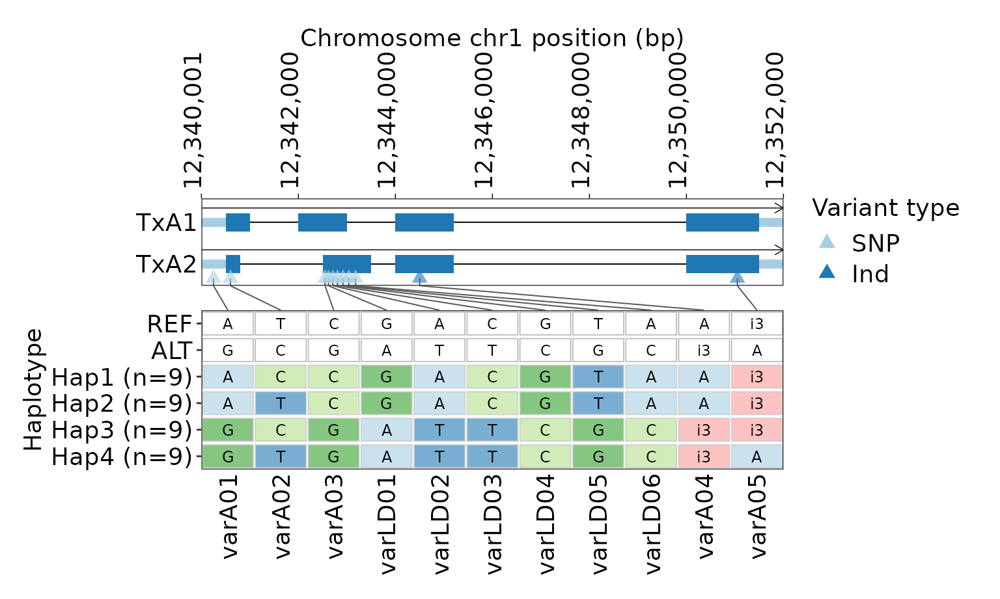
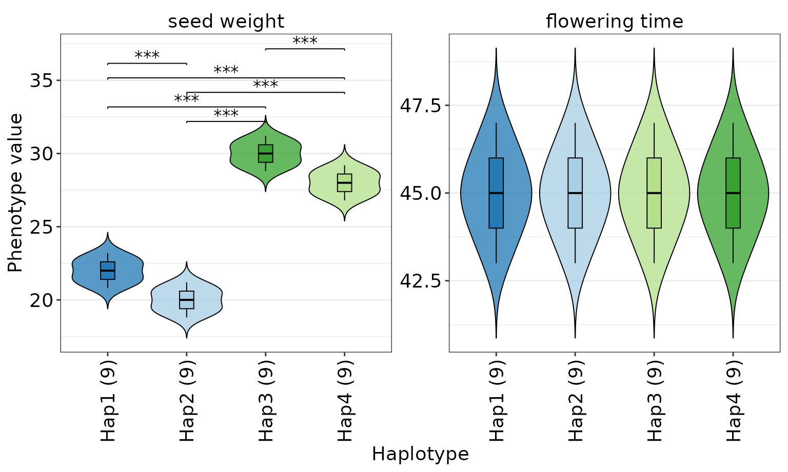
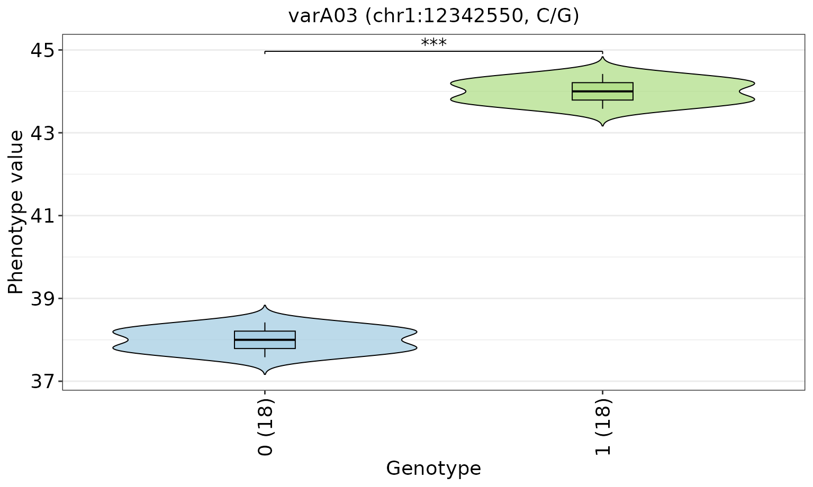
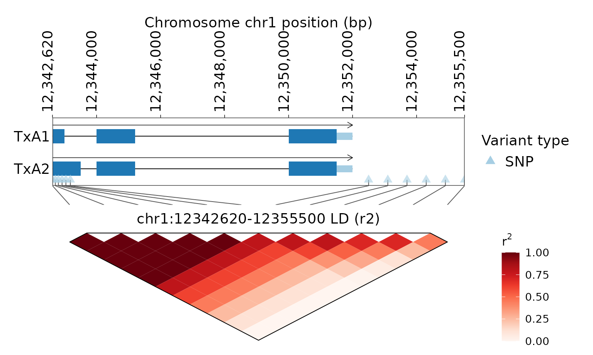
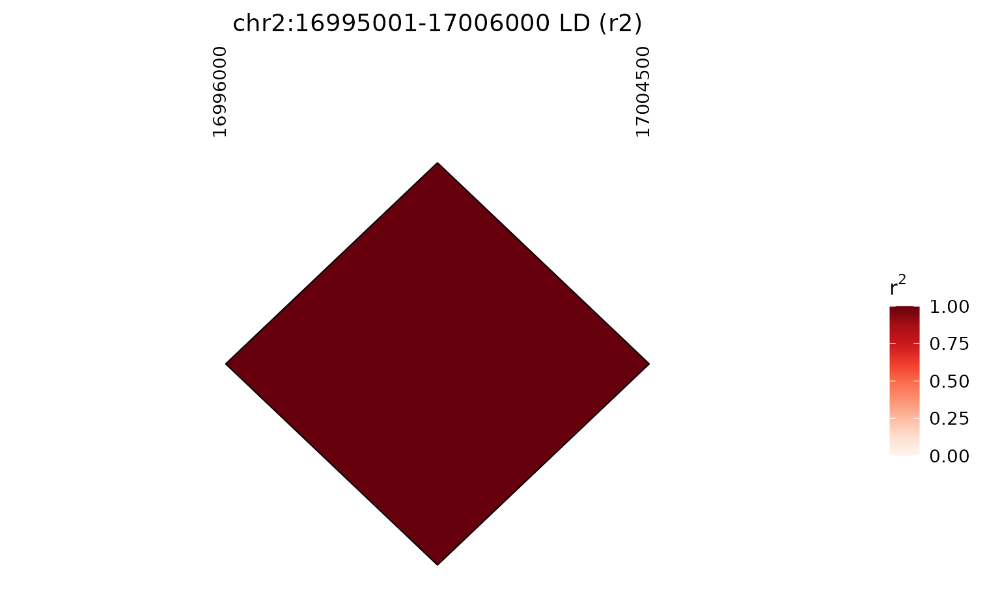
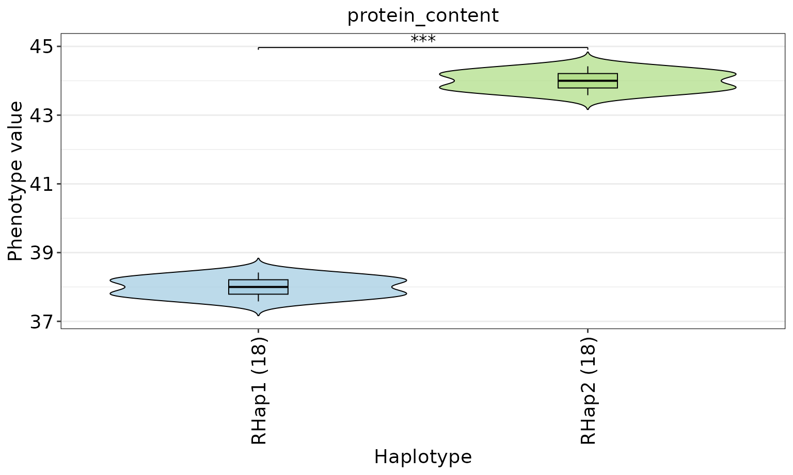
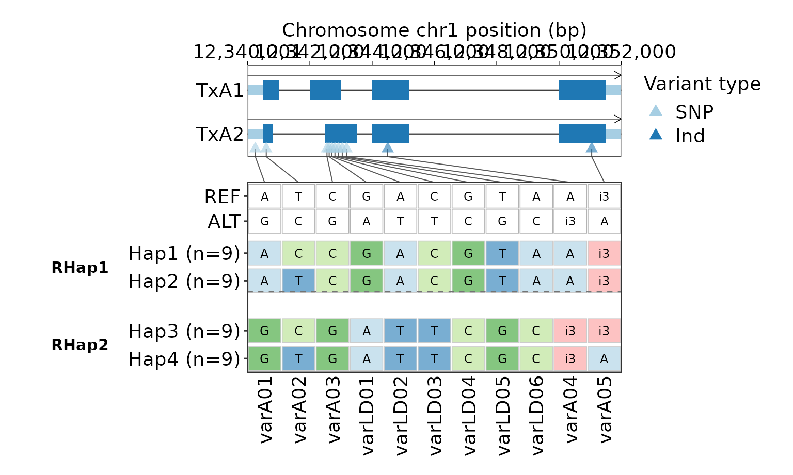
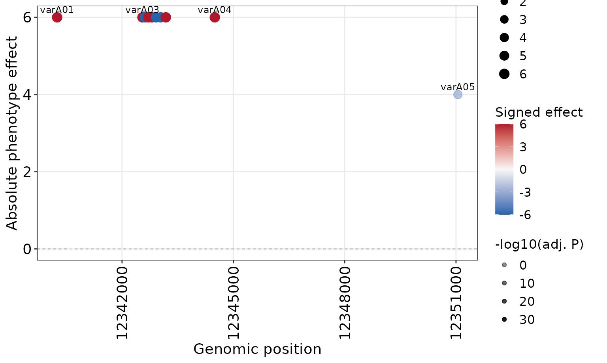

# GeneTrackR deterministic demo workflows

This vignette uses the single deterministic `gtr_demo_*` dataset shipped
with GeneTrackR. The same annotation, VCF, phenotype table, and designed
truth are shared across annotation, variant, haplotype, LD, refinement,
and variant-effect workflows.

## Load the canonical demo inputs

``` r

library(GeneTrackR)

gp_file <- system.file("extdata", "gtr_demo.genePredExt", package = "GeneTrackR")
gtf_file <- system.file("extdata", "gtr_demo.gtf", package = "GeneTrackR")
gff_file <- system.file("extdata", "gtr_demo.gff3", package = "GeneTrackR")
bed_file <- system.file("extdata", "gtr_demo_features.bed", package = "GeneTrackR")
vcf_file <- system.file("extdata", "gtr_demo_variants.vcf", package = "GeneTrackR")
pheno_file <- system.file("extdata", "gtr_demo_pheno.tsv", package = "GeneTrackR")

gp <- read_genepred(gp_file, format = "genePredExt", verbose = FALSE)
gtf <- read_gtf(gtf_file, verbose = FALSE, progress = FALSE)
gff <- read_gff(gff_file, verbose = FALSE, progress = FALSE)
features <- read_bed(bed_file, verbose = FALSE, progress = FALSE)
vcf <- read_vcf(vcf_file, mode = "memory", verbose = FALSE)
pheno <- read_pheno(pheno_file, verbose = FALSE)
```

The three annotation formats describe the same canonical 20-gene,
24-transcript model. The VCF contains 56 designed variants in 36
samples. Phenotype row order is intentionally different from VCF sample
order, so downstream analyses must align by `sample_id`.

## Object contracts used in the workflow

The workflow deliberately passes package objects between functions
rather than rebuilding intermediate tables. `gp` is a `GenePred`,
`features` is a `FeatureTrack`, `vcf` is a `VariantTrack`, and `pheno`
is a `data.table`. The `VariantTrack` feeds variant-phenotype and LD
analyses;
[`hap_gene_variant()`](https://renscq.github.io/GeneTrackR/reference/hap_gene_variant.md)
creates a `HapVariant` for haplotype plots, haplotype-phenotype
analysis, refinement, and variant-effect analysis;
[`refine_haplotype()`](https://renscq.github.io/GeneTrackR/reference/refine_haplotype.md)
creates a `HapRefined` for refined plots.

Plotting functions have two return conventions in this vignette:

- gene/track/haplotype-variant plots return a ggplot/patchwork figure
  directly;
- phenotype and variant-effect plots return result objects with a
  `$figure` field plus analysis tables;
- [`plot_ld_block()`](https://renscq.github.io/GeneTrackR/reference/plot_ld_block.md)
  returns the updated `LDTrack` by default and stores its figure in
  `$figure`.

## Annotation and feature retrieval

`GeneA` is a positive-strand protein-coding gene with two transcripts.
`GeneB` is a negative-strand two-transcript gene.

``` r

genea <- retrieve_feature(gp, gene_id = "GeneA")
geneb <- retrieve_feature(gp, gene_id = "GeneB")

genea$genes
#>    gene_id  chrom strand gene_start gene_end n_transcripts gene_type
#>     <char> <char> <char>      <int>    <int>         <int>    <char>
#> 1:   GeneA   chr1      +   12340001 12352000             2    coding
geneb$genes
#>    gene_id  chrom strand gene_start gene_end n_transcripts gene_type
#>     <char> <char> <char>      <int>    <int>         <int>    <char>
#> 1:   GeneB   chr1      -   12356001 12366500             2    coding
```

The BED file contains promoters, enhancers, candidate regions, a QTL
interval, repeats, and conserved regions around the designed loci.

``` r

head(features$data)
#>    feature_id                                    name  chrom    start      end
#>        <char>                                  <char> <char>    <int>    <int>
#> 1:      BED_4                      SeedWeight_QTL|QTL   chr1 12330001 12380000
#> 2:      BED_2                 GeneA_enhancer|enhancer   chr1 12338201 12338750
#> 3:      BED_1                 GeneA_promoter|promoter   chr1 12339001 12340000
#> 4:      BED_3 GeneA_candidate_region|candidate_region   chr1 12339701 12352000
#> 5:      BED_5                     GeneA_repeat|repeat   chr1 12343201 12343800
#> 6:      BED_6        GeneA_conserved|conserved_region   chr1 12350401 12350900
#>      type   level score strand source gene_id transcript_id parent_id gene_type
#>    <char>  <char> <num> <char> <char>  <char>        <char>    <char>    <char>
#> 1:    BED feature     0      *    BED    <NA>          <NA>      <NA>      <NA>
#> 2:    BED feature     0      *    BED    <NA>          <NA>      <NA>      <NA>
#> 3:    BED feature     0      +    BED    <NA>          <NA>      <NA>      <NA>
#> 4:    BED feature     0      *    BED    <NA>          <NA>      <NA>      <NA>
#> 5:    BED feature     0      *    BED    <NA>          <NA>      <NA>      <NA>
#> 6:    BED feature     0      *    BED    <NA>          <NA>      <NA>      <NA>
#>    exon_number  phase attribute
#>          <int> <char>    <char>
#> 1:          NA   <NA>      <NA>
#> 2:          NA   <NA>      <NA>
#> 3:          NA   <NA>      <NA>
#> 4:          NA   <NA>      <NA>
#> 5:          NA   <NA>      <NA>
#> 6:          NA   <NA>      <NA>
```

## Variant retrieval

The main GeneA interval contains SNPs, insertions, deletions, a high-LD
block, and a deliberately incomplete upstream variant.

``` r

genea_variants <- retrieve_vcf(
  vcf,
  chrom = "chr1",
  start = 12339700,
  end = 12352000,
  as = "VariantTrack",
  verbose = FALSE
)

genea_variants
#> <VariantTrack>
#>   variants  : 12 
#>   format    : VCF 
#>   coordinate: 1-based position
genea_variants$data[, c("variant_id", "chrom", "pos", "ref", "alt"), with = FALSE]
#>     variant_id  chrom      pos    ref    alt
#>         <char> <char>    <int> <char> <char>
#>  1:   varAup01   chr1 12339750      A      T
#>  2:     varA01   chr1 12340250      A      G
#>  3:     varA02   chr1 12340600      T      C
#>  4:     varA03   chr1 12342550      C      G
#>  5:    varLD01   chr1 12342620      G      A
#>  6:    varLD02   chr1 12342710      A      T
#>  7:    varLD03   chr1 12342805      C      T
#>  8:    varLD04   chr1 12342920      G      C
#>  9:    varLD05   chr1 12343040      T      G
#> 10:    varLD06   chr1 12343180      A      C
#> 11:     varA04   chr1 12344500      A    ATG
#> 12:     varA05   chr1 12351050    ATG      A
```

[`retrieve_vcf()`](https://renscq.github.io/GeneTrackR/reference/retrieve_vcf.md)
returns a `data.table` by default; `as = "VariantTrack"` is set here
because the subset is retained as a package object.

## GeneA haplotypes

The GeneA gene body was designed to produce four balanced
genotype-defined groups of nine samples each.

``` r

hap <- hap_gene_variant(
  vcf,
  annotation = gp,
  gene_id = "GeneA",
  genotype_mode = "string",
  min_variant_number = 1
)
#> [GeneTrackR] Retrieved variants: 11.

hap$haplotypes
#> Key: <hap_id>
#>    hap_id sample_n                             samples varA01 varA02 varA03
#>    <char>    <int>                              <char> <char> <char> <char>
#> 1:   Hap1        9 S10;S11;S12;S13;S14;S15;S16;S17;S18      A      C      C
#> 2:   Hap2        9 S01;S02;S03;S04;S05;S06;S07;S08;S09      A      T      C
#> 3:   Hap3        9 S19;S20;S21;S22;S23;S24;S25;S26;S27      G      C      G
#> 4:   Hap4        9 S28;S29;S30;S31;S32;S33;S34;S35;S36      G      T      G
#>    varLD01 varLD02 varLD03 varLD04 varLD05 varLD06 varA04 varA05
#>     <char>  <char>  <char>  <char>  <char>  <char> <char> <char>
#> 1:       G       A       C       G       T       A      A     i3
#> 2:       G       A       C       G       T       A      A     i3
#> 3:       A       T       T       C       G       C     i3     i3
#> 4:       A       T       T       C       G       C     i3      A
```

``` r

hap_figure <- plot_hap_variant(
  hap,
  annotation = gp,
  min_hap_samples = 3,
  show_reference_row = TRUE,
  gene_pos_x_angle = 90
)
hap_figure
```



## Haplotype-phenotype association

`seed_weight` has a designed GeneA haplotype effect. `flowering_time` is
a negative-control trait with the same distribution in all four designed
groups.

``` r

hap_pheno <- plot_hap_pheno(
  hap,
  phenotype = pheno,
  traits = c("seed_weight", "flowering_time"),
  min_hap_samples = 3,
  facet_ncol = 2
)
#> Warning in melt.data.table(dt, id.vars = c("sample_id", "hap_id"), measure.vars
#> = traits, : 'measure.vars' [seed_weight, flowering_time, ...] are not all of
#> the same type. By order of hierarchy, the molten data value column will be of
#> type 'double'. All measure variables not of type 'double' will be coerced too.
#> Check DETAILS in ?melt.data.table for more on coercion.

hap_pheno$figure
```



``` r

hap_pheno$pvalue
#>              trait group1 group2      p_value        p_adj method
#>             <char> <char> <char>        <num>        <num> <char>
#>  1:    seed_weight   Hap2   Hap1 7.740671e-05 7.740671e-05 t.test
#>  2:    seed_weight   Hap2   Hap3 1.344894e-14 8.069366e-14 t.test
#>  3:    seed_weight   Hap2   Hap4 4.343207e-13 8.686413e-13 t.test
#>  4:    seed_weight   Hap1   Hap3 4.343207e-13 8.686413e-13 t.test
#>  5:    seed_weight   Hap1   Hap4 3.540311e-11 5.310467e-11 t.test
#>  6:    seed_weight   Hap3   Hap4 7.740671e-05 7.740671e-05 t.test
#>  7: flowering_time   Hap2   Hap1 1.000000e+00 1.000000e+00 t.test
#>  8: flowering_time   Hap2   Hap3 1.000000e+00 1.000000e+00 t.test
#>  9: flowering_time   Hap2   Hap4 1.000000e+00 1.000000e+00 t.test
#> 10: flowering_time   Hap1   Hap3 1.000000e+00 1.000000e+00 t.test
#> 11: flowering_time   Hap1   Hap4 1.000000e+00 1.000000e+00 t.test
#> 12: flowering_time   Hap3   Hap4 1.000000e+00 1.000000e+00 t.test
```

## Single-variant phenotype association

`varA03` was designed so its ALT genotype is associated with higher
`protein_content`.

``` r

variant_pheno <- plot_variant_pheno(
  vcf,
  phenotype = pheno,
  variant_id = "varA03",
  traits = "protein_content",
  genotype_mode = "code",
  min_group_samples = 3
)

variant_pheno$figure
```



``` r

variant_pheno$pvalue
#>              trait group1 group2      p_value        p_adj method
#>             <char> <char> <char>        <num>        <num> <char>
#> 1: protein_content      0      1 2.008652e-37 2.008652e-37 t.test
```

## Linkage disequilibrium

`varLD01` through `varLD12` provide a deterministic LD-gradient example
with a six-variant perfect core and progressively weaker downstream
linkage.

``` r

ld <- compute_ld_block(
  vcf,
  chrom = "chr1",
  start = 12342620,
  end = 12355500,
  variant_type = "snp",
  method = "r2",
  verbose = FALSE
)

ld$data
#>     variant_i variant_j index_i index_j    pos_i    pos_j distance_bp n_samples
#>        <char>    <char>   <int>   <int>    <int>    <int>       <int>     <int>
#>  1:   varLD01   varLD02       1       2 12342620 12342710          90        36
#>  2:   varLD01   varLD03       1       3 12342620 12342805         185        36
#>  3:   varLD01   varLD04       1       4 12342620 12342920         300        36
#>  4:   varLD01   varLD05       1       5 12342620 12343040         420        36
#>  5:   varLD01   varLD06       1       6 12342620 12343180         560        36
#>  6:   varLD01   varLD07       1       7 12342620 12352500        9880        36
#>  7:   varLD01   varLD08       1       8 12342620 12353100       10480        36
#>  8:   varLD01   varLD09       1       9 12342620 12353700       11080        36
#>  9:   varLD01   varLD10       1      10 12342620 12354300       11680        36
#> 10:   varLD01   varLD11       1      11 12342620 12354900       12280        36
#> 11:   varLD01   varLD12       1      12 12342620 12355500       12880        36
#> 12:   varLD02   varLD03       2       3 12342710 12342805          95        36
#> 13:   varLD02   varLD04       2       4 12342710 12342920         210        36
#> 14:   varLD02   varLD05       2       5 12342710 12343040         330        36
#> 15:   varLD02   varLD06       2       6 12342710 12343180         470        36
#> 16:   varLD02   varLD07       2       7 12342710 12352500        9790        36
#> 17:   varLD02   varLD08       2       8 12342710 12353100       10390        36
#> 18:   varLD02   varLD09       2       9 12342710 12353700       10990        36
#> 19:   varLD02   varLD10       2      10 12342710 12354300       11590        36
#> 20:   varLD02   varLD11       2      11 12342710 12354900       12190        36
#> 21:   varLD02   varLD12       2      12 12342710 12355500       12790        36
#> 22:   varLD03   varLD04       3       4 12342805 12342920         115        36
#> 23:   varLD03   varLD05       3       5 12342805 12343040         235        36
#> 24:   varLD03   varLD06       3       6 12342805 12343180         375        36
#> 25:   varLD03   varLD07       3       7 12342805 12352500        9695        36
#> 26:   varLD03   varLD08       3       8 12342805 12353100       10295        36
#> 27:   varLD03   varLD09       3       9 12342805 12353700       10895        36
#> 28:   varLD03   varLD10       3      10 12342805 12354300       11495        36
#> 29:   varLD03   varLD11       3      11 12342805 12354900       12095        36
#> 30:   varLD03   varLD12       3      12 12342805 12355500       12695        36
#> 31:   varLD04   varLD05       4       5 12342920 12343040         120        36
#> 32:   varLD04   varLD06       4       6 12342920 12343180         260        36
#> 33:   varLD04   varLD07       4       7 12342920 12352500        9580        36
#> 34:   varLD04   varLD08       4       8 12342920 12353100       10180        36
#> 35:   varLD04   varLD09       4       9 12342920 12353700       10780        36
#> 36:   varLD04   varLD10       4      10 12342920 12354300       11380        36
#> 37:   varLD04   varLD11       4      11 12342920 12354900       11980        36
#> 38:   varLD04   varLD12       4      12 12342920 12355500       12580        36
#> 39:   varLD05   varLD06       5       6 12343040 12343180         140        36
#> 40:   varLD05   varLD07       5       7 12343040 12352500        9460        36
#> 41:   varLD05   varLD08       5       8 12343040 12353100       10060        36
#> 42:   varLD05   varLD09       5       9 12343040 12353700       10660        36
#> 43:   varLD05   varLD10       5      10 12343040 12354300       11260        36
#> 44:   varLD05   varLD11       5      11 12343040 12354900       11860        36
#> 45:   varLD05   varLD12       5      12 12343040 12355500       12460        36
#> 46:   varLD06   varLD07       6       7 12343180 12352500        9320        36
#> 47:   varLD06   varLD08       6       8 12343180 12353100        9920        36
#> 48:   varLD06   varLD09       6       9 12343180 12353700       10520        36
#> 49:   varLD06   varLD10       6      10 12343180 12354300       11120        36
#> 50:   varLD06   varLD11       6      11 12343180 12354900       11720        36
#> 51:   varLD06   varLD12       6      12 12343180 12355500       12320        36
#> 52:   varLD07   varLD08       7       8 12352500 12353100         600        36
#> 53:   varLD07   varLD09       7       9 12352500 12353700        1200        36
#> 54:   varLD07   varLD10       7      10 12352500 12354300        1800        36
#> 55:   varLD07   varLD11       7      11 12352500 12354900        2400        36
#> 56:   varLD07   varLD12       7      12 12352500 12355500        3000        36
#> 57:   varLD08   varLD09       8       9 12353100 12353700         600        36
#> 58:   varLD08   varLD10       8      10 12353100 12354300        1200        36
#> 59:   varLD08   varLD11       8      11 12353100 12354900        1800        36
#> 60:   varLD08   varLD12       8      12 12353100 12355500        2400        36
#> 61:   varLD09   varLD10       9      10 12353700 12354300         600        36
#> 62:   varLD09   varLD11       9      11 12353700 12354900        1200        36
#> 63:   varLD09   varLD12       9      12 12353700 12355500        1800        36
#> 64:   varLD10   varLD11      10      11 12354300 12354900         600        36
#> 65:   varLD10   varLD12      10      12 12354300 12355500        1200        36
#> 66:   varLD11   varLD12      11      12 12354900 12355500         600        36
#>     variant_i variant_j index_i index_j    pos_i    pos_j distance_bp n_samples
#>        <char>    <char>   <int>   <int>    <int>    <int>       <int>     <int>
#>             r         r2          D Dprime_signed    Dprime       p_i       p_j
#>         <num>      <num>      <num>         <num>     <num>     <num>     <num>
#>  1: 1.0000000 1.00000000 0.50000000     1.0000000 1.0000000 0.5000000 0.5000000
#>  2: 1.0000000 1.00000000 0.50000000     1.0000000 1.0000000 0.5000000 0.5000000
#>  3: 1.0000000 1.00000000 0.50000000     1.0000000 1.0000000 0.5000000 0.5000000
#>  4: 1.0000000 1.00000000 0.50000000     1.0000000 1.0000000 0.5000000 0.5000000
#>  5: 1.0000000 1.00000000 0.50000000     1.0000000 1.0000000 0.5000000 0.5000000
#>  6: 0.8888889 0.79012346 0.44444444     1.0000000 1.0000000 0.5000000 0.5000000
#>  7: 0.7777778 0.60493827 0.38888889     1.0000000 1.0000000 0.5000000 0.5000000
#>  8: 0.6666667 0.44444444 0.33333333     1.0000000 1.0000000 0.5000000 0.5000000
#>  9: 0.5007734 0.25077399 0.25000000     1.0000000 1.0000000 0.5000000 0.5277778
#> 10: 0.3333333 0.11111111 0.16666667     0.6666667 0.6666667 0.5000000 0.5000000
#> 11: 0.0000000 0.00000000 0.00000000     0.0000000 0.0000000 0.5000000 0.5000000
#> 12: 1.0000000 1.00000000 0.50000000     1.0000000 1.0000000 0.5000000 0.5000000
#> 13: 1.0000000 1.00000000 0.50000000     1.0000000 1.0000000 0.5000000 0.5000000
#> 14: 1.0000000 1.00000000 0.50000000     1.0000000 1.0000000 0.5000000 0.5000000
#> 15: 1.0000000 1.00000000 0.50000000     1.0000000 1.0000000 0.5000000 0.5000000
#> 16: 0.8888889 0.79012346 0.44444444     1.0000000 1.0000000 0.5000000 0.5000000
#> 17: 0.7777778 0.60493827 0.38888889     1.0000000 1.0000000 0.5000000 0.5000000
#> 18: 0.6666667 0.44444444 0.33333333     1.0000000 1.0000000 0.5000000 0.5000000
#> 19: 0.5007734 0.25077399 0.25000000     1.0000000 1.0000000 0.5000000 0.5277778
#> 20: 0.3333333 0.11111111 0.16666667     0.6666667 0.6666667 0.5000000 0.5000000
#> 21: 0.0000000 0.00000000 0.00000000     0.0000000 0.0000000 0.5000000 0.5000000
#> 22: 1.0000000 1.00000000 0.50000000     1.0000000 1.0000000 0.5000000 0.5000000
#> 23: 1.0000000 1.00000000 0.50000000     1.0000000 1.0000000 0.5000000 0.5000000
#> 24: 1.0000000 1.00000000 0.50000000     1.0000000 1.0000000 0.5000000 0.5000000
#> 25: 0.8888889 0.79012346 0.44444444     1.0000000 1.0000000 0.5000000 0.5000000
#> 26: 0.7777778 0.60493827 0.38888889     1.0000000 1.0000000 0.5000000 0.5000000
#> 27: 0.6666667 0.44444444 0.33333333     1.0000000 1.0000000 0.5000000 0.5000000
#> 28: 0.5007734 0.25077399 0.25000000     1.0000000 1.0000000 0.5000000 0.5277778
#> 29: 0.3333333 0.11111111 0.16666667     0.6666667 0.6666667 0.5000000 0.5000000
#> 30: 0.0000000 0.00000000 0.00000000     0.0000000 0.0000000 0.5000000 0.5000000
#> 31: 1.0000000 1.00000000 0.50000000     1.0000000 1.0000000 0.5000000 0.5000000
#> 32: 1.0000000 1.00000000 0.50000000     1.0000000 1.0000000 0.5000000 0.5000000
#> 33: 0.8888889 0.79012346 0.44444444     1.0000000 1.0000000 0.5000000 0.5000000
#> 34: 0.7777778 0.60493827 0.38888889     1.0000000 1.0000000 0.5000000 0.5000000
#> 35: 0.6666667 0.44444444 0.33333333     1.0000000 1.0000000 0.5000000 0.5000000
#> 36: 0.5007734 0.25077399 0.25000000     1.0000000 1.0000000 0.5000000 0.5277778
#> 37: 0.3333333 0.11111111 0.16666667     0.6666667 0.6666667 0.5000000 0.5000000
#> 38: 0.0000000 0.00000000 0.00000000     0.0000000 0.0000000 0.5000000 0.5000000
#> 39: 1.0000000 1.00000000 0.50000000     1.0000000 1.0000000 0.5000000 0.5000000
#> 40: 0.8888889 0.79012346 0.44444444     1.0000000 1.0000000 0.5000000 0.5000000
#> 41: 0.7777778 0.60493827 0.38888889     1.0000000 1.0000000 0.5000000 0.5000000
#> 42: 0.6666667 0.44444444 0.33333333     1.0000000 1.0000000 0.5000000 0.5000000
#> 43: 0.5007734 0.25077399 0.25000000     1.0000000 1.0000000 0.5000000 0.5277778
#> 44: 0.3333333 0.11111111 0.16666667     0.6666667 0.6666667 0.5000000 0.5000000
#> 45: 0.0000000 0.00000000 0.00000000     0.0000000 0.0000000 0.5000000 0.5000000
#> 46: 0.8888889 0.79012346 0.44444444     1.0000000 1.0000000 0.5000000 0.5000000
#> 47: 0.7777778 0.60493827 0.38888889     1.0000000 1.0000000 0.5000000 0.5000000
#> 48: 0.6666667 0.44444444 0.33333333     1.0000000 1.0000000 0.5000000 0.5000000
#> 49: 0.5007734 0.25077399 0.25000000     1.0000000 1.0000000 0.5000000 0.5277778
#> 50: 0.3333333 0.11111111 0.16666667     0.6666667 0.6666667 0.5000000 0.5000000
#> 51: 0.0000000 0.00000000 0.00000000     0.0000000 0.0000000 0.5000000 0.5000000
#> 52: 0.8888889 0.79012346 0.44444444     1.0000000 1.0000000 0.5000000 0.5000000
#> 53: 0.7777778 0.60493827 0.38888889     1.0000000 1.0000000 0.5000000 0.5000000
#> 54: 0.6120564 0.37461300 0.30555556     1.0000000 1.0000000 0.5000000 0.5277778
#> 55: 0.4444444 0.19753086 0.22222222     0.8888889 0.8888889 0.5000000 0.5000000
#> 56: 0.1111111 0.01234568 0.05555556     0.2222222 0.2222222 0.5000000 0.5000000
#> 57: 0.8888889 0.79012346 0.44444444     1.0000000 1.0000000 0.5000000 0.5000000
#> 58: 0.7233393 0.52321981 0.36111111     1.0000000 1.0000000 0.5000000 0.5277778
#> 59: 0.5555556 0.30864198 0.27777778     1.0000000 1.0000000 0.5000000 0.5000000
#> 60: 0.2222222 0.04938272 0.11111111     0.4444444 0.4444444 0.5000000 0.5000000
#> 61: 0.8346223 0.69659443 0.41666667     1.0000000 1.0000000 0.5000000 0.5277778
#> 62: 0.6666667 0.44444444 0.33333333     1.0000000 1.0000000 0.5000000 0.5000000
#> 63: 0.3333333 0.11111111 0.16666667     0.6666667 0.6666667 0.5000000 0.5000000
#> 64: 0.8346223 0.69659443 0.41666667     1.0000000 1.0000000 0.5277778 0.5000000
#> 65: 0.5007734 0.25077399 0.25000000     1.0000000 1.0000000 0.5277778 0.5000000
#> 66: 0.6666667 0.44444444 0.33333333     1.0000000 1.0000000 0.5000000 0.5000000
#>             r         r2          D Dprime_signed    Dprime       p_i       p_j
#>         <num>      <num>      <num>         <num>     <num>     <num>     <num>
#>             ld method
#>          <num> <char>
#>  1: 1.00000000     r2
#>  2: 1.00000000     r2
#>  3: 1.00000000     r2
#>  4: 1.00000000     r2
#>  5: 1.00000000     r2
#>  6: 0.79012346     r2
#>  7: 0.60493827     r2
#>  8: 0.44444444     r2
#>  9: 0.25077399     r2
#> 10: 0.11111111     r2
#> 11: 0.00000000     r2
#> 12: 1.00000000     r2
#> 13: 1.00000000     r2
#> 14: 1.00000000     r2
#> 15: 1.00000000     r2
#> 16: 0.79012346     r2
#> 17: 0.60493827     r2
#> 18: 0.44444444     r2
#> 19: 0.25077399     r2
#> 20: 0.11111111     r2
#> 21: 0.00000000     r2
#> 22: 1.00000000     r2
#> 23: 1.00000000     r2
#> 24: 1.00000000     r2
#> 25: 0.79012346     r2
#> 26: 0.60493827     r2
#> 27: 0.44444444     r2
#> 28: 0.25077399     r2
#> 29: 0.11111111     r2
#> 30: 0.00000000     r2
#> 31: 1.00000000     r2
#> 32: 1.00000000     r2
#> 33: 0.79012346     r2
#> 34: 0.60493827     r2
#> 35: 0.44444444     r2
#> 36: 0.25077399     r2
#> 37: 0.11111111     r2
#> 38: 0.00000000     r2
#> 39: 1.00000000     r2
#> 40: 0.79012346     r2
#> 41: 0.60493827     r2
#> 42: 0.44444444     r2
#> 43: 0.25077399     r2
#> 44: 0.11111111     r2
#> 45: 0.00000000     r2
#> 46: 0.79012346     r2
#> 47: 0.60493827     r2
#> 48: 0.44444444     r2
#> 49: 0.25077399     r2
#> 50: 0.11111111     r2
#> 51: 0.00000000     r2
#> 52: 0.79012346     r2
#> 53: 0.60493827     r2
#> 54: 0.37461300     r2
#> 55: 0.19753086     r2
#> 56: 0.01234568     r2
#> 57: 0.79012346     r2
#> 58: 0.52321981     r2
#> 59: 0.30864198     r2
#> 60: 0.04938272     r2
#> 61: 0.69659443     r2
#> 62: 0.44444444     r2
#> 63: 0.11111111     r2
#> 64: 0.69659443     r2
#> 65: 0.25077399     r2
#> 66: 0.44444444     r2
#>             ld method
#>          <num> <char>
```

``` r

ld <- plot_ld_block(
  ld,
  annotation = gp,
  show_region = TRUE,
  show_variant_labels = FALSE
)
ld$figure
```



The `GeneT` interval on chromosome 2 contains exactly two variants and
is retained as the stable two-variant LD geometry case.

``` r

ld_pair <- compute_ld_block(
  vcf,
  chrom = "chr2",
  start = 16995001,
  end = 17006000,
  method = "r2",
  verbose = FALSE
)
ld_pair_figure <- plot_ld_block(ld_pair, return_object = FALSE)
ld_pair_figure
```



## Phenotype-guided haplotype refinement

``` r

refined <- refine_haplotype(
  hap,
  phenotype = pheno,
  traits = "protein_content",
  min_hap_samples = 3,
  effect_threshold = 0.5
)

refined$refined_haplotypes
#>    hap_id original_hap_n original_hap_ids sample_n
#>    <char>          <int>           <char>    <int>
#> 1:  RHap1              2        Hap1;Hap2       18
#> 2:  RHap2              2        Hap3;Hap4       18
#>                                                                    samples
#>                                                                     <char>
#> 1: S10;S11;S12;S13;S14;S15;S16;S17;S18;S01;S02;S03;S04;S05;S06;S07;S08;S09
#> 2: S19;S20;S21;S22;S23;S24;S25;S26;S27;S28;S29;S30;S31;S32;S33;S34;S35;S36
#>    varA01 varA02 varA03 varLD01 varLD02 varLD03 varLD04 varLD05 varLD06 varA04
#>    <char> <char> <char>  <char>  <char>  <char>  <char>  <char>  <char> <char>
#> 1:      A  mixed      C       G       A       C       G       T       A      A
#> 2:      G  mixed      G       A       T       T       C       G       C     i3
#>    varA05
#>    <char>
#> 1:     i3
#> 2:  mixed
```

``` r

refined_pheno <- plot_refined_hap_pheno(
  refined,
  phenotype = pheno,
  traits = "protein_content",
  min_hap_samples = 3
)
refined_pheno$figure
```



``` r

refined_pheno$pvalue
#>              trait group1 group2      p_value        p_adj method
#>             <char> <char> <char>        <num>        <num> <char>
#> 1: protein_content  RHap1  RHap2 2.008652e-37 2.008652e-37 t.test
```

The refined haplotype-variant plot returns a figure directly:

``` r

refined_variant_figure <- plot_refined_hap_variant(
  refined,
  annotation = gp,
  min_hap_samples = 3
)
refined_variant_figure
```



## Variant-effect prioritization

``` r

effect_res <- plot_variant_effect(
  hap,
  phenotype = pheno,
  traits = "protein_content",
  min_group_samples = 3,
  x_axis = "position"
)

effect_res$figure
```



``` r

effect_res$effect
#>     variant_id           trait group_n sample_n effect abs_effect low_group
#>         <char>          <char>   <int>    <int>  <num>      <num>    <char>
#>  1:     varA01 protein_content       2       36      6          6         A
#>  2:     varA02 protein_content       2       36      0          0         C
#>  3:     varA03 protein_content       2       36      6          6         C
#>  4:    varLD01 protein_content       2       36     -6          6         A
#>  5:    varLD02 protein_content       2       36      6          6         A
#>  6:    varLD03 protein_content       2       36      6          6         C
#>  7:    varLD04 protein_content       2       36     -6          6         C
#>  8:    varLD05 protein_content       2       36     -6          6         G
#>  9:    varLD06 protein_content       2       36      6          6         A
#> 10:     varA04 protein_content       2       36      6          6         A
#> 11:     varA05 protein_content       2       36     -4          4         A
#>     high_group low_group_mean high_group_mean      p_value test_method
#>         <char>          <num>           <num>        <num>      <char>
#>  1:          G             38              44 2.008652e-37      t.test
#>  2:          T             41              41 1.000000e+00      t.test
#>  3:          G             38              44 2.008652e-37      t.test
#>  4:          G             44              38 2.008652e-37      t.test
#>  5:          T             38              44 2.008652e-37      t.test
#>  6:          T             38              44 2.008652e-37      t.test
#>  7:          G             44              38 2.008652e-37      t.test
#>  8:          T             44              38 2.008652e-37      t.test
#>  9:          C             38              44 2.008652e-37      t.test
#> 10:         i3             38              44 2.008652e-37      t.test
#> 11:         i3             44              40 1.190766e-07      t.test
#>                      group_summary        p_adj variant_label  chrom      pos
#>                             <char>        <num>        <char> <char>    <int>
#>  1:  A:n=18,mean=38;G:n=18,mean=44 2.455019e-37        varA01   chr1 12340250
#>  2:  C:n=18,mean=41;T:n=18,mean=41 1.000000e+00        varA02   chr1 12340600
#>  3:  C:n=18,mean=38;G:n=18,mean=44 2.455019e-37        varA03   chr1 12342550
#>  4:  A:n=18,mean=44;G:n=18,mean=38 2.455019e-37       varLD01   chr1 12342620
#>  5:  A:n=18,mean=38;T:n=18,mean=44 2.455019e-37       varLD02   chr1 12342710
#>  6:  C:n=18,mean=38;T:n=18,mean=44 2.455019e-37       varLD03   chr1 12342805
#>  7:  C:n=18,mean=44;G:n=18,mean=38 2.455019e-37       varLD04   chr1 12342920
#>  8:  G:n=18,mean=44;T:n=18,mean=38 2.455019e-37       varLD05   chr1 12343040
#>  9:  A:n=18,mean=38;C:n=18,mean=44 2.455019e-37       varLD06   chr1 12343180
#> 10: A:n=18,mean=38;i3:n=18,mean=44 2.455019e-37        varA04   chr1 12344500
#> 11:  A:n=9,mean=44;i3:n=27,mean=40 1.309843e-07        varA05   chr1 12351050
#>     variant_index plot_effect plot_log10_padj  x_value
#>             <int>       <num>           <num>    <num>
#>  1:             1           6       36.609945 12340250
#>  2:             2           0        0.000000 12340600
#>  3:             3           6       36.609945 12342550
#>  4:             4           6       36.609945 12342620
#>  5:             5           6       36.609945 12342710
#>  6:             6           6       36.609945 12342805
#>  7:             7           6       36.609945 12342920
#>  8:             8           6       36.609945 12343040
#>  9:             9           6       36.609945 12343180
#> 10:            10           6       36.609945 12344500
#> 11:            11           4        6.882781 12351050
```

The deterministic model is intended to make documentation examples and
regression tests share the same biological and statistical expectations
rather than maintaining separate example datasets for each module.
