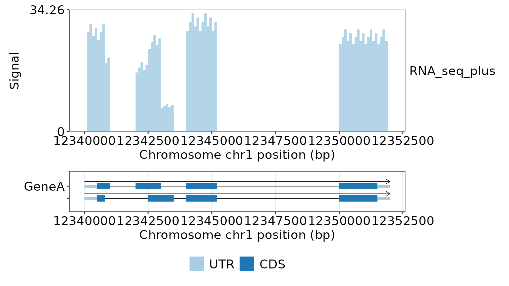
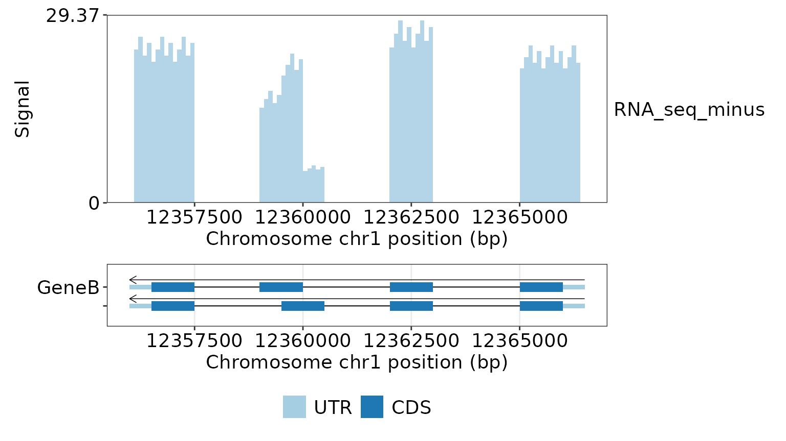
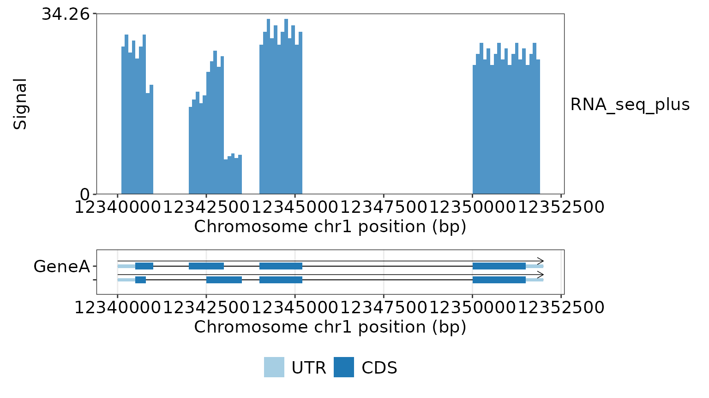
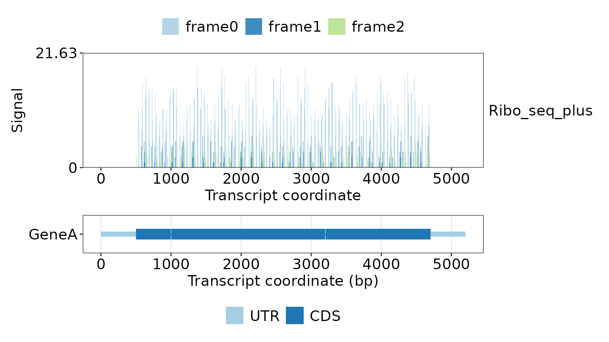
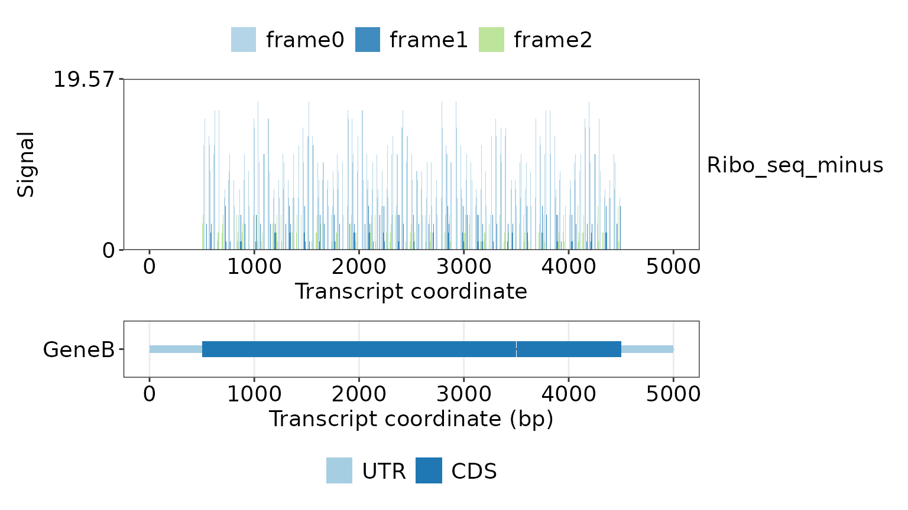
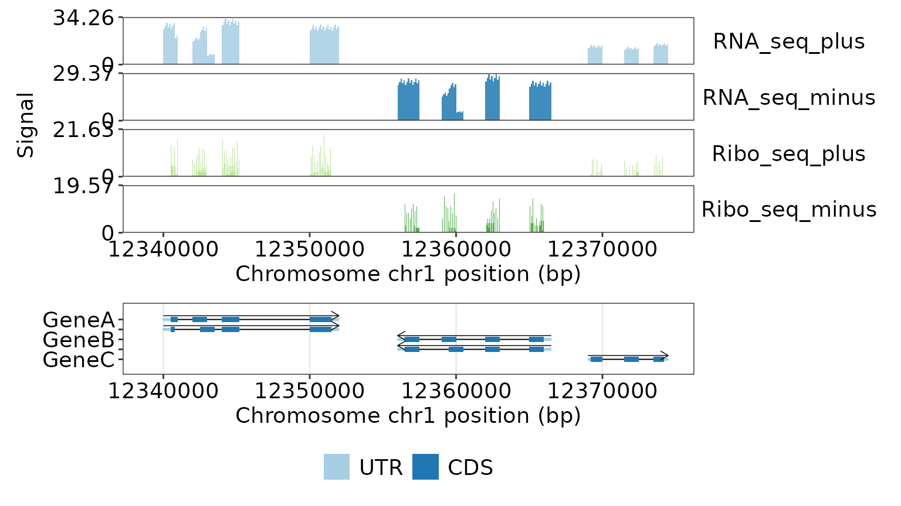
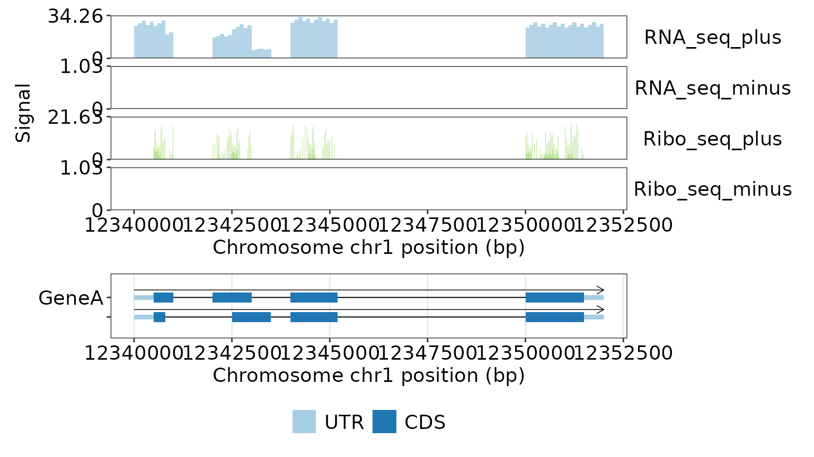

# Strand-specific RNA-seq and Ribo-seq signal tracks

This vignette uses the deterministic GeneTrackR demo genome. RNA-seq and
Ribo-seq signals are each represented by separate plus- and minus-strand
bedGraph files.

## Load annotation and signal files

``` r

library(GeneTrackR)

gp <- read_genepred(
  system.file("extdata", "gtr_demo.genePredExt", package = "GeneTrackR"),
  format = "genePredExt",
  verbose = FALSE
)

rnaseq_files <- system.file(
  "extdata",
  c("gtr_demo_rnaseq_plus.bedgraph", "gtr_demo_rnaseq_minus.bedgraph"),
  package = "GeneTrackR"
)

riboseq_files <- system.file(
  "extdata",
  c("gtr_demo_riboseq_plus.bedgraph", "gtr_demo_riboseq_minus.bedgraph"),
  package = "GeneTrackR"
)
```

bedGraph does not store strand metadata. The strand is therefore
supplied explicitly when constructing the `BwgTrack` objects.

[`read_bwg()`](https://renscq.github.io/GeneTrackR/reference/read_bwg.md)
returns a `BwgTrack`. The signal plotting functions used below return
ggplot/patchwork figures directly; they do not return a list with a
`$figure` field.
[`merge_bwg()`](https://renscq.github.io/GeneTrackR/reference/merge_bwg.md)
returns another `BwgTrack`, so the merged object can be passed directly
into any signal plotting function.

``` r

rnaseq <- read_bwg(
  rnaseq_files,
  format = "bedgraph",
  sample_names = c("RNA_seq_plus", "RNA_seq_minus"),
  strand = c("+", "-"),
  mode = "memory",
  verbose = FALSE
)

riboseq <- read_bwg(
  riboseq_files,
  format = "bedgraph",
  sample_names = c("Ribo_seq_plus", "Ribo_seq_minus"),
  strand = c("+", "-"),
  mode = "memory",
  verbose = FALSE
)

rnaseq$samples[, c("sample_id", "strand"), with = FALSE]
#>        sample_id strand
#>           <char> <char>
#> 1:  RNA_seq_plus      +
#> 2: RNA_seq_minus      -
riboseq$samples[, c("sample_id", "strand"), with = FALSE]
#>         sample_id strand
#>            <char> <char>
#> 1:  Ribo_seq_plus      +
#> 2: Ribo_seq_minus      -
```

## RNA-seq: exon-enriched coverage

The RNA-seq demo tracks contain signal over exons, including UTRs.
Designed intronic and intergenic regions have no bedGraph records.
`GeneA` is on the plus strand and `GeneB` is on the minus strand.

``` r

rnaseq_genea_figure <- plot_signal_gene(
  signal = rnaseq,
  annotation = gp,
  gene_id = "GeneA",
  plot_type = "bar",
  signal_y_scale = "fixed"
)
rnaseq_genea_figure
```



``` r

rnaseq_geneb_figure <- plot_signal_gene(
  signal = rnaseq,
  annotation = gp,
  gene_id = "GeneB",
  plot_type = "bar",
  signal_y_scale = "fixed"
)
rnaseq_geneb_figure
```



## Palette direction and panel proportions

`signal_palette_direction` reverses the standard palette order before
discrete colors are assigned. The effect is visible even when
strand-aware retrieval leaves a single signal sample. Explicit
`signal_colors` remain unchanged because they are treated as exact user
mappings.

``` r

rnaseq_palette_figure <- plot_signal_gene(
  signal = rnaseq,
  annotation = gp,
  gene_id = "GeneA",
  plot_type = "bar",
  signal_palette = "Blues",
  signal_palette_direction = -1,
  signal_y_scale = "fixed",
  signal_track_height = 4,
  gene_track_height = 1
)
rnaseq_palette_figure
```



The same height arguments are available in
[`plot_signal_transcript()`](https://renscq.github.io/GeneTrackR/reference/plot_signal_transcript.md)
and
[`plot_signal_region()`](https://renscq.github.io/GeneTrackR/reference/plot_signal_region.md).
The integrated
[`plot_tracks()`](https://renscq.github.io/GeneTrackR/reference/plot_tracks.md)
function already exposes a named `heights` vector.

## Ribo-seq: sparse base-resolution P-site counts

The Ribo-seq tracks contain moderately dense one-base integer
P-site-like counts only in CDS regions. Frame 0 is broadly occupied with
variable heights, while frame 1 and frame 2 use different codon subsets
with lower irregular counts. Zero-count bases are omitted. Counts follow
transcript orientation, are distributed at approximately 80%/10%/10%
across frame 0/frame 1/frame 2, and initiation/termination frame-0
counts are approximately two times the internal frame-0 mean.

For the positive-strand `TxA1` transcript:

``` r

riboseq_plus_figure <- plot_signal_transcript(
  signal = riboseq,
  annotation = gp,
  transcript_id = "TxA1",
  coordinate = "transcript",
  plot_type = "frame"
)
riboseq_plus_figure
```



For the negative-strand `TxB1` transcript:

``` r

riboseq_minus_figure <- plot_signal_transcript(
  signal = riboseq,
  annotation = gp,
  transcript_id = "TxB1",
  coordinate = "transcript",
  plot_type = "frame"
)
riboseq_minus_figure
```



## Combine all four signal tracks

RNA-seq and Ribo-seq objects have distinct sample IDs and can therefore
be merged directly.

``` r

signal_all <- merge_bwg(rnaseq, riboseq)
summary_bwg(signal_all)
#>         sample_id sum_signal mean_signal max_signal covered_bases
#>            <char>      <num>       <num>      <num>         <int>
#> 1:   RNA_seq_plus   632305.6   13.715957     33.264         46100
#> 2:  RNA_seq_minus   361448.2   12.463731     28.512         29000
#> 3:  Ribo_seq_plus    83318.0    4.124858     21.000         20199
#> 4: Ribo_seq_minus    45395.0    3.977133     19.000         11414
```

A regional plot can display both assays and both strands over the
GeneA-GeneB-GeneC locus.

``` r

regional_signal_figure <- plot_signal_region(
  signal = signal_all,
  annotation = gp,
  chrom = "chr1",
  start = 12339001,
  end = 12374500,
  strand = "both",
  plot_type = "bar"
)
regional_signal_figure
```



The same `BwgTrack` can be passed directly to
[`plot_tracks()`](https://renscq.github.io/GeneTrackR/reference/plot_tracks.md).
Here it is combined with the GeneA annotation track:

``` r

integrated_signal_figure <- plot_tracks(
  annotation = gp,
  signal = signal_all,
  gene_id = "GeneA",
  signal_type = "bar"
)
integrated_signal_figure
```


